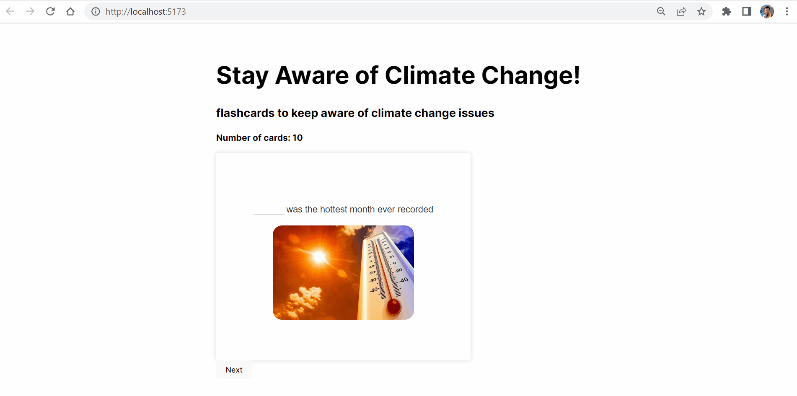

# Climate Change FlashCards

Submitted by: Johnny A. Cortez

This app generates a random flashcard over climate change facts to raise more awareness towards climate change

Time spent: 6 hours spent in total

## Required Features

The title of the card set and some information about it, such as a short description and the total number of cards are displayed - completed

A single card at a time is displayed, only showing one of the components of the information pair - completed

Create a list of card pairs (an array of dictionaries where each dictionary contains the question and answer is perfectly fine) - completed

Clicking on the card shows the corresponding component of the information pair - completed

Clicking the next button displays a random new card - completed

## Stretch Features

Cards contain images in addition to or in place of text - completed

## Video Walkthrough

Here's a walkthrough of implemented features:

GIF created with ScreenToGif

## Notes

## License

    Copyright [2023] [Johnny A. Cortez]

    Licensed under the Apache License, Version 2.0 (the "License");
    you may not use this file except in compliance with the License.
    You may obtain a copy of the License at

        http://www.apache.org/licenses/LICENSE-2.0

    Unless required by applicable law or agreed to in writing, software
    distributed under the License is distributed on an "AS IS" BASIS,
    WITHOUT WARRANTIES OR CONDITIONS OF ANY KIND, either express or implied.
    See the License for the specific language governing permissions and
    limitations under the License.
